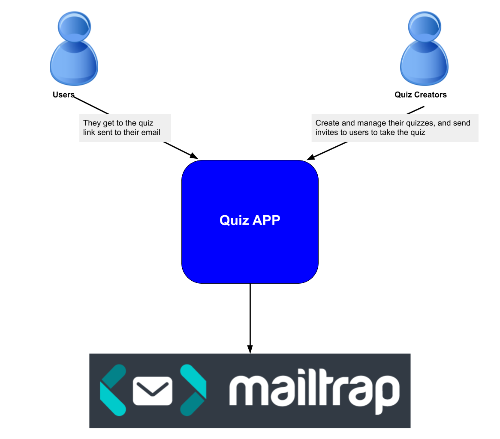

This project was bootstrapped with [Create React App](https://github.com/facebook/create-react-app).

# QUIZ APP, Simple React APP

## How it works? (User presepective)

- The app has two modules, quiz maker and quiz taker
- Quiz maker is a user who can create and manage quizzes, and send invitations to quiz takers
- Quiz taker is a user who takes the quiz, as per the invitation recieved from the quiz maker

## Context Daigram

## How it works? (developer presepective)

- You should have mongodb installed
- Clone the repo to your computer
- In your command line run `npm install` to install dependencies
- to start the server run `npm run server`
- to start the app UI run `npm start`